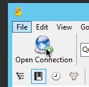
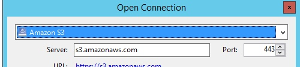
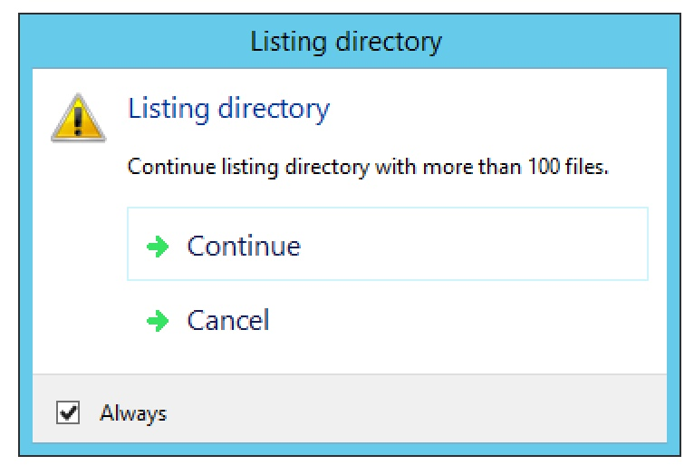
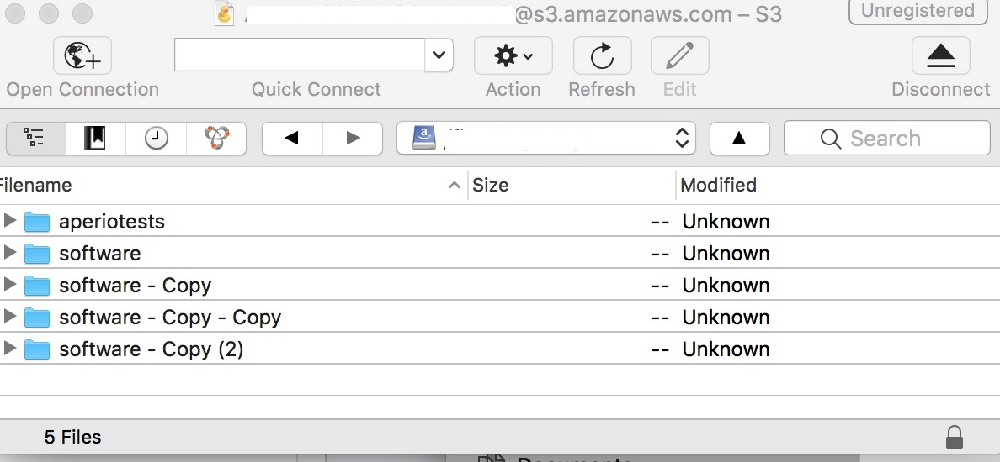

# Using S3 with Cyberduck at Fred Hutch

## Step 1: Obtain your AWS Credentials

To use Cyberduck with S3, you will need AWS credentials. You can obtain them by going to

[https://toolbox.fhcrc.org/sw2srv/aws/account](https://toolbox.fhcrc.org/sw2srv/aws/account)

Notes:

* This page will prompt you for your HutchNet ID and password.
* You can only access this page from the Fred Hutch network (or when connected via VPN).

This page will display your Access Key and Secret Key. Please keep this page open for use in the next step.

**NOTE**: Do NOT share these credentials with any other user, inside or outside of Fred Hutch. If another Fred Hutch
employee needs credentials, they can obtain their own credentials in this same manner. If you need credentials for an
external collaborator, or if you are having a permissions issue,
please contact [Scientific Computing](https://centernet.fredhutch.org/cn/u/center-it/cio/scicomp.html).

## Step 2: Install Cyberduck

You can get Cyberduck at [https://cyberduck.io/](https://cyberduck.io/).
If you are on a Windows system, click the "Download Cyberduck for Windows" link on the left side of the page.
If you are on a Mac, click the "Download Cyberduck for Mac"
link on the left side of the page. In either case, a file will be downloaded.

### Windows Installation

* Double-click the file that was downloaded in the previous step. Click "Install".
Click "Yes" when asked if you want to allow the program to make changes on the computer.
If all goes well, after a short installation, you should see "Installation Successfully Completed". Click "Close".

* To run Cyberduck, click the Start button, then click the Search (magnifying glass) icon in the upper right, and type `cyberduck` into the search box that shows up, and press Enter. Cyberduck will start. To make it easier to start in the future, locate the Cyberduck icon in your task bar at the bottom of the screen, and right-click on it, then select "Pin this program to taskbar". You'll now be able to start Cyberduck just by clicking on that icon, will will remain there even when Cyberduck is not running.

### Mac Installation

* Double-click on the zip file that was downloaded in the previous step. This will open a Finder menu showing the default download directory (usually `Downloads` under your home directory) with the Cyberduck application selected. At this point you could go ahead and start Cyberduck by double-clicking on it, but it will be easier to find Cyberduck in future if it is installed in `/Applications` with your other apps.

#### Moving Cyberduck to Applications

* Go to Finder.
* Click on the `File` menu at the top of your screen and choose `New Finder Window`. (You can also accomplish this by pressing ⌘N (Command-N)).
* In the new window, click on Applications.
* Go to the other Finder window where the Cyberduck application is selected. Drag the Cyberduck icon to the Applications directory in the other finder window.
* You will now always be able to find Cyberduck in `/Applications` along with all your other apps.
* Double-click the Cyberduck icon.
* When you see the dialog box that says "Cyberduck is an application downloaded from the Internet. Are you sure you want to open it?", click "Open".

## Step 3: Configure Cyberduck for use with Uganda bucket

* Click the "Open Connection" Button

* In the dropdown at the top, choose `Amazon S3`.

* Copy your Access Key from the web page you opened in Step 1.
* Paste it into the `Access Key ID` box in the Cyberduck "Open Connection" dialog box.
* Copy your Secret Key from the web page you opened in Step 1.
* Paste it into the `Password` box in the Cyberduck "Open Connection" dialog box.
* Click the `Connect` button

If you see a dialog warning that Cyberduck is about to list more than 100 items, check the `Always` box and click `Continue`.

</image>

You should now see a long listing of all the S3 Buckets that exist at Fred Hutch.
You will typically only work with one or two of these.

## Step 3: Find Your Bucket

Buckets are organized by lab and department. If you work in a lab and your PI is Jane Doe, your bucket will be called
`fh-pi-doe-j`.

Find that bucket in the Cyberduck listing and double-click on it.

You will see a listing of files in the bucket.

</image>

You can now interact with these files, You can delete them, or rename them. Copy files to or from the bucket by dragging
files from or to Explorer (Windows) or Finder (Mac).

## Copying files into your bucket

## Copying files from your bucket to your computer

&nbsp;

&nbsp;

&nbsp;

&nbsp;

